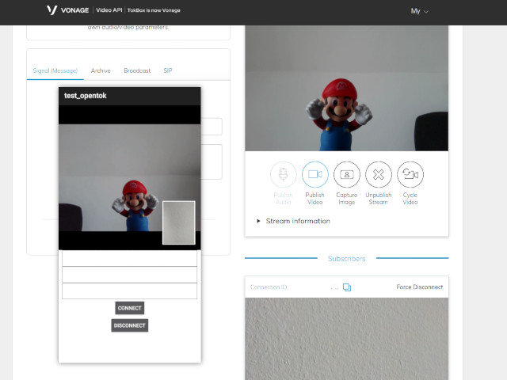

# Vonage module for Appcelerator Titanium



<br/>
<br/>

<span class="badge-buymeacoffee"><a href="https://www.buymeacoffee.com/miga" title="donate"></a></span>

## Requirements

* Titanium SDK 9+ (Android), 9.2.0+ (iOS)
* Vonage <small>(formerly OpenTok)</small> account
* For Android: Add the following like to your [app]/platform/android/build.gradle
```gradle
repositories {
  google()
  jcenter()
  mavenCentral()
}
```

* For iOS: Add the following privacy keys to the <plist> section of your tiapp.xml:
```xml
<key>NSCameraUsageDescription</key>
<string>We need to access your camera (use your own description)</string>
<key>NSMicrophoneUsageDescription</key>
<string>We need to access your microphone (use your own description)</string>
```

## API

### Properties
* apiKey
* sessionId
* token
* audioOnly (creation only)

### Methods
* connect
* disconnect

### Events
* ready
* disconnected
* streamReceived: view, userType, streamId, connectionData, connectionId, connectionCreationTime
* streamDropped
* sessionError
* streamCreated
* streamDestroyed
* error

## How to use it

Listen to the `streamReceived` event. It will return a `view` with the videos. You'll add those views to your normal Ti app. The `userType` and `streamId` will help you to e.g. remove them later again if a participant will disconnect.

## Example

```xml
<modules>
    <module>ti.vonage</module>
</modules>
```

```javascript
import TiVonage from 'ti.vonage';

const API_KEY = ''; // Get from https://tokbox.com/developer/
const SESSION_ID = '; // Get from https://tokbox.com/developer/tools/playground/
const TOKEN = ''; // Get from https://tokbox.com/developer/tools/playground/

function onOpen() {
  if (OS_ANDROID) {
    TiVonage.initialize();
    return;
  }

  // iOS requires some privacy permissions first
  Ti.Media.requestCameraPermissions(event => {
    if (!event.success) {
      alert('No access to camera!');
    }

    Ti.Media.requestAudioRecorderPermissions(event => {
      if (!event.success) {
        alert('No access to microphone!');
      }
  
      TiVonage.initialize();
    });
  });
}

TiVonage.addEventListener('ready', () => {
  console.log('ready');
});

TiVonage.addEventListener('streamReceived', event => {
  // view with the camera stream:
  const view = Ti.UI.createView({
    height: 190,
    width: 190
  });

  view.add(event.view);
  window.add(view);

  console.log('Type:', event.userType);
  if (event.userType == 'subscriber') {
    console.log('Stream id:', event.streamId);
    console.log('Connection data:', event.connectionData);
    console.log('Connection id:', event.connectionId);
    console.log('Connection time:', event.connectionCreationTime);
  }
});

TiVonage.addEventListener('streamDropped', event => {
  console.log(event.userType, event.streamId);
});

function onClickConnect() {
  TiVonage.apiKey = API_KEY;
  TiVonage.sessionId = SESSION_ID;
  TiVonage.token = TOKEN;

  TiVonage.connect();
}

function onClickDisconnect() {
  TiVonage.disconnect();
}

const window = Ti.UI.createWindow();
const btn = Ti.UI.createButton({ title: 'Connect' });

window.addEventListener('open', onOpen);
btn.addEventListener('click', onClickConnect);

window.add(btn);
window.open();

```

## License

Apache 2.0

## Author

Michael Gangolf ([@m1ga](https://github.com/m1ga))
